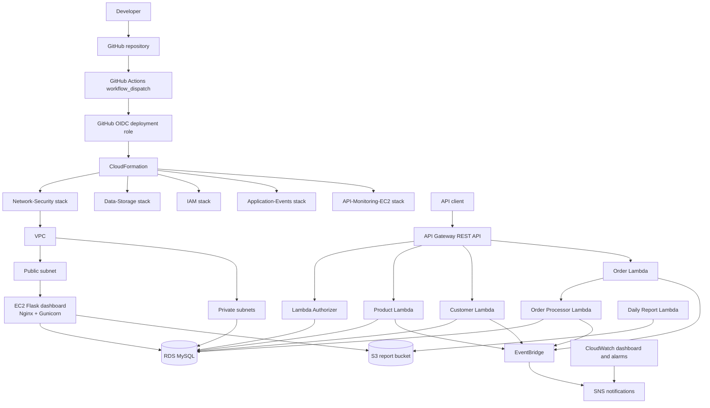

# CloudMart

CloudMart is an AWS-based e-commerce application built with AWS CloudFormation, GitHub Actions OIDC, API Gateway, Lambda, Amazon RDS for MySQL, S3, SSM Parameter Store, EventBridge, SNS, CloudWatch, and an EC2-hosted Flask operations dashboard.

> **Final submission status:** Update only after checking the live deployment.  
> **API invoke URL:** `<add verified API Gateway stage URL>`  
> **Dashboard URL:** `<add verified dashboard URL>`  
> **Region:** `ap-south-1` · **Environment:** `dev` or `prod` from `config/config.json`

## Architecture



The VPC places the dashboard EC2 instance in the public subnet and RDS in private subnets. Database-connected Lambdas use the configured private networking. Customer bearer tokens are hashed and validated against RDS. The administrator token is stored separately in SSM SecureString.

The deployed design uses RDS MySQL for customers, products, inventory, and orders. **DynamoDB and SQS are not part of this implementation.** The Order Lambda invokes the Order Processor synchronously so the normal successful API path can return the processor’s final `CONFIRMED` result rather than an asynchronous `PENDING` acknowledgement.

## CloudFormation stacks

| Stack | Template | Responsibility |
|---|---|---|
| `cloudmart-network-security-{environment}` | `cloudformation/network-stack.yaml` | VPC, subnets, routing, security groups, endpoints |
| `cloudmart-data-storage-{environment}` | `cloudformation/data-stack.yaml` | RDS MySQL, S3 artifact/report buckets, DB SSM parameters |
| `cloudmart-iam-{environment}` | `cloudformation/iam-stack.yaml` | Lambda/EC2 roles and policies, auth parameter provisioning |
| `cloudmart-application-events-{environment}` | `cloudformation/application-events-stack.yaml` | Authorizer, application/report Lambdas, layer, schema initialization, EventBridge, SNS |
| `cloudmart-api-monitoring-ec2-{environment}` | `cloudformation/api-monitoring-ec2-stack.yaml` | API Gateway, authorizer integration, CloudWatch, EC2 dashboard |

## Repository layout

```text
.github/workflows/deploy.yaml
config/config.json
cloudformation/
  network-stack.yaml
  data-stack.yaml
  iam-stack.yaml
  application-events-stack.yaml
  api-monitoring-ec2-stack.yaml
database/schema.sql
lambda/
  authorizer/lambda_function.py
  product/lambda_function.py
  customer/lambda_function.py
  order/lambda_function.py
  order-processor/lambda_function.py
  daily-report/lambda_function.py
dashboard/
  app.py
  requirements.txt
  bootstrap-dashboard.sh
docs/
  architecture.md
  data-model.md
  deployment-runbook.md
  crud-verification.md
```

## Authentication and authorization

- Protected API routes use the API Gateway Lambda Authorizer.
- Customer tokens are SHA-256 hashed before storage and checked against active, non-deleted customer records in RDS.
- Multiple active customers may share a bearer token; the implementation must not assume token uniqueness.
- A customer’s token is intended to remain stable across logins.
- The administrator token is stored separately as an SSM SecureString.
- Customer-scoped handlers must authorize the customer ID in the route against the caller’s authorizer context.
- Customer deletion is a soft delete; inactive/deleted records should not authorize requests.
- Customer creation is configured as a public onboarding route; verify its deployed method authorization before exposing it beyond the intended environment.

Never commit credentials, bearer tokens, account-specific secrets, or passwords.

## API route families

Confirm exact methods and request schemas against the deployed API Gateway resource tree and Lambda handlers.

### Products
| Method | Route | Purpose |
|---|---|---|
| POST | `/products` | Create |
| GET | `/products` | List |
| GET | `/products/{product_id}` | Read |
| PUT | `/products/{product_id}` | Update |
| DELETE | `/products/{product_id}` | Delete |

### Customers
| Method | Route | Purpose |
|---|---|---|
| POST | `/customers` | Create customer |
| GET | `/customers` | Administrative listing |
| GET | `/customers/{customer_id}` | Customer-scoped read |
| PUT/PATCH | `/customers/{customer_id}` | Update |
| DELETE | `/customers/{customer_id}` | Soft delete, subject to authorization |

### Orders
| Method | Route | Purpose |
|---|---|---|
| POST | `/customers/{customer_id}/orders` | Place customer order |
| GET | `/customers/{customer_id}/orders` | List customer orders |
| GET | `/customers/{customer_id}/orders/{order_id}` | Read customer order |
| PUT | `/customers/{customer_id}/orders/{order_id}` | Update configured order fields |
| PATCH | `/customers/{customer_id}/orders/{order_id}/status` | Status update under role/ownership rules |
| Admin routes | `/orders` and configured subroutes | Administrative read/status operations |

A customer may cancel only their own order. The administrator/owner must not cancel customer orders; administrative status changes must follow the roles and statuses enforced by the current handler.

## Events, reporting, and operations

Product, customer, order, and processor handlers publish configured events to EventBridge. Rules route matching events to SNS notifications. The scheduled Daily Report Lambda writes reports to the CloudFormation-managed S3 report bucket. The EC2 Flask dashboard displays operational data and report access. CloudWatch provides dashboards, metrics, and alarms with SNS actions.

The dashboard is refreshed on the existing CloudFormation-managed EC2 instance through SSM. The workflow does not create a second EC2 instance or a separate manual artifact bucket.

## Configuration and secrets

`config/config.json` is the workflow’s source of truth for `Environment`, `Project`, `ManagedBy`, and `Owner`. The supported environments are `dev` and `prod`. Runtime parameters are under `/cloudmart/{environment}/...`.

| Value | Source |
|---|---|
| AWS region | Workflow environment, `ap-south-1` |
| Environment/project metadata | `config/config.json` |
| AWS deployment role | GitHub Actions secret `AWS_ROLE_ARN`, assumed via OIDC |
| Alert email | GitHub Actions secret `CLOUDMART_ALERT_EMAIL` |
| RDS master password | Required manual `workflow_dispatch` input `db_password` |
| DB/auth runtime values | SSM Parameter Store; secret values use SecureString as configured |

## Deployment

See [docs/deployment-runbook.md](docs/deployment-runbook.md) for prerequisites, workflow steps, validation, verification, troubleshooting, and teardown. The workflow is manually triggered, validates configuration, deploys the five stacks in dependency order, packages Lambda artifacts, and verifies resources.

## Final review checklist

- [ ] Latest intended-branch GitHub Actions run is green.
- [ ] All five CloudFormation stacks have successful complete statuses.
- [ ] API invoke URL and dashboard URL are verified and recorded above.
- [ ] Missing/invalid bearer tokens are rejected on protected routes.
- [ ] Valid customer access is limited to authorized customer resources.
- [ ] Product/customer/order CRUD paths have evidence recorded in `docs/crud-verification.md`.
- [ ] Successful order placement returns `CONFIRMED` on the normal path.
- [ ] Cross-customer order access/cancellation is rejected.
- [ ] EventBridge, SNS, daily report, dashboard, and CloudWatch alarms are verified.
- [ ] CloudFormation drift detection is reviewed for all stacks.
- [ ] No credentials or secrets are present in repository history.
- [ ] Teardown and data-retention requirements are understood.

## Teardown

Delete stacks in reverse dependency order using CloudFormation: API-Monitoring-EC2, Application-Events, IAM, Data-Storage, then Network-Security. Back up required database/report data first, check termination protection and S3 contents, and verify the target environment. Do not manually delete individual resources to bypass a failed stack.

## Documentation

- [Architecture](docs/architecture.md)
- [Data model](docs/data-model.md)
- [Deployment runbook](docs/deployment-runbook.md)
- [CRUD verification](docs/crud-verification.md)
